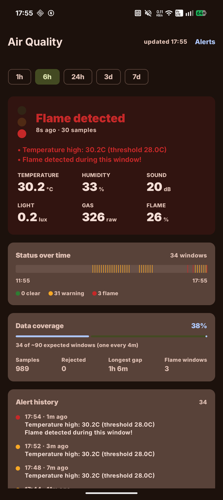
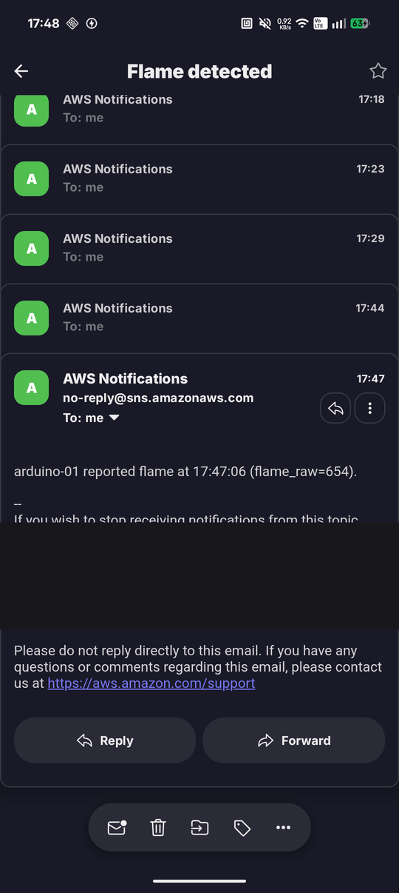
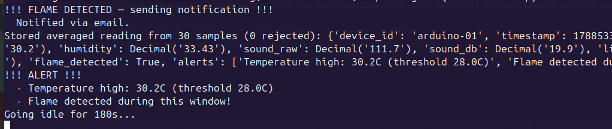
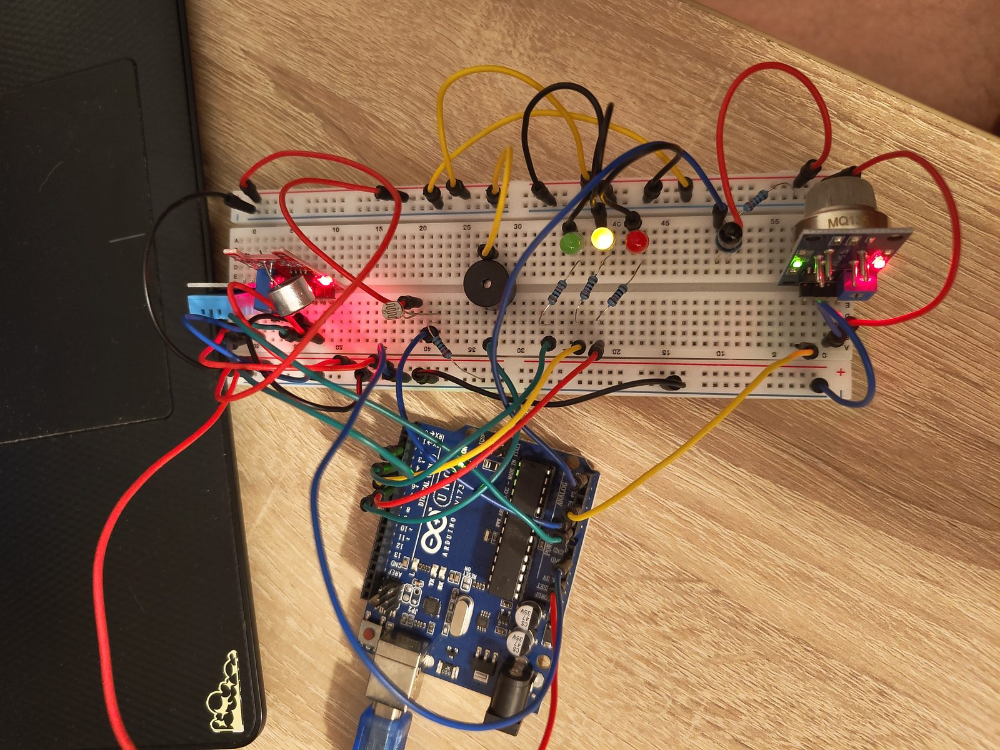
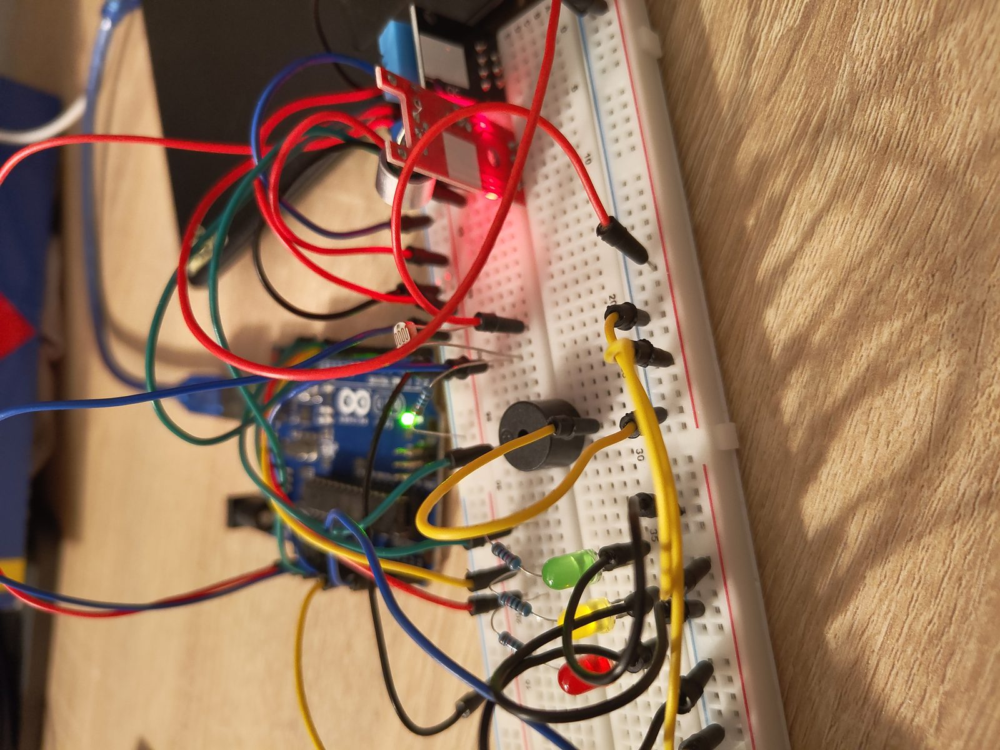
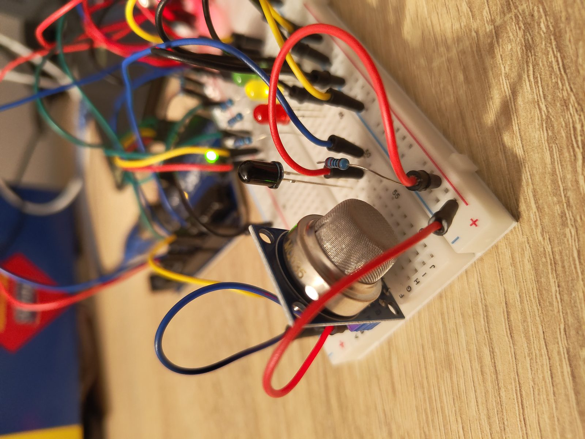
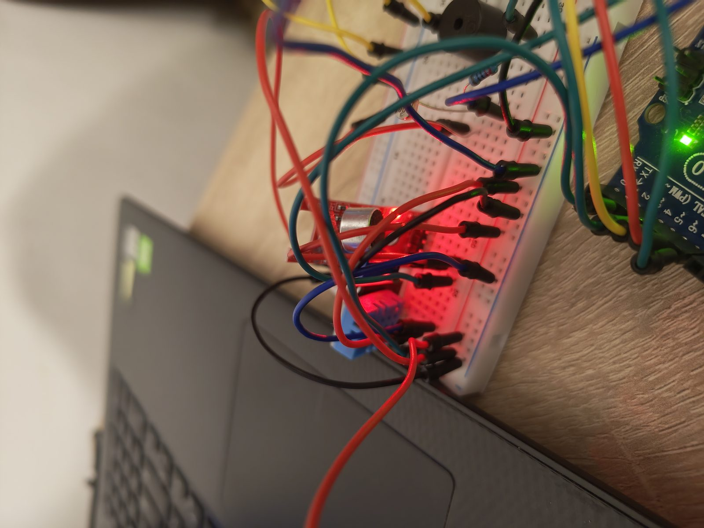
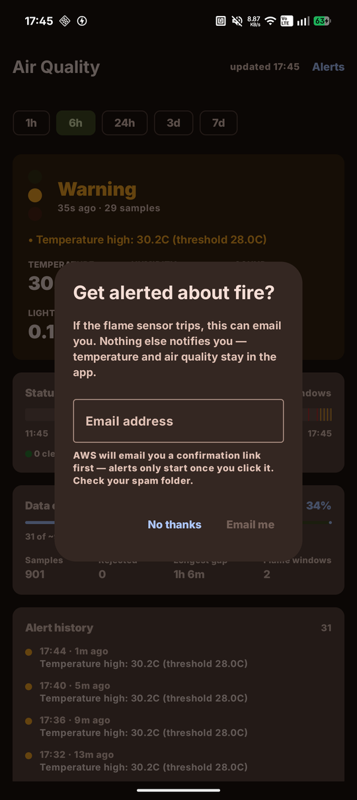
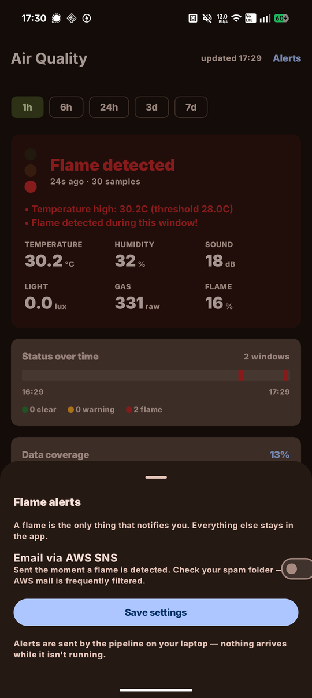
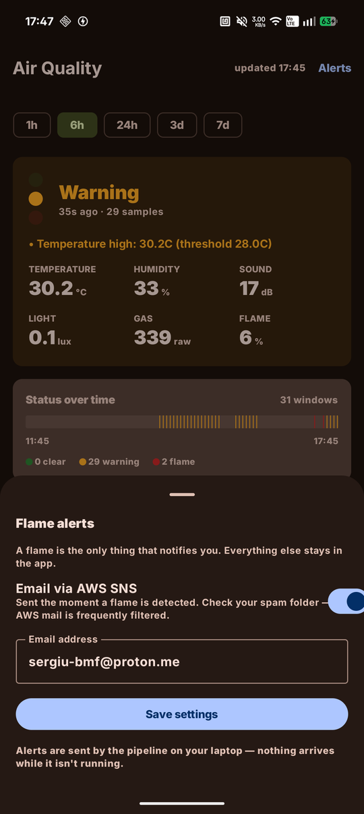

# AirQualityV2

[](https://sergiu-bmf.github.io/AirQualityV2/)
[](https://github.com/Sergiu-bmf/AirQualityV2/actions/workflows/docs.yml)
[](#architecture)

A self-built environmental monitor. An Arduino Uno reads temperature, humidity, sound,
light, gas and flame; a Python pipeline on a laptop averages those readings and writes
them to DynamoDB; a Lambda serves them over HTTP; and a native Android app shows the
current state, the history, and how trustworthy that history actually is.

If the flame sensor trips, it emails you within about two seconds.

| Live status | Flame alert email | Pipeline |
|---|---|---|
|  |  |  |

---

## What it actually does

- **Samples six sensors** every ~2 seconds and shows an instant traffic light (green /
  yellow / red LEDs plus a buzzer) directly on the breadboard, with no computer involved.
- **Averages a 60-second window** of readings and stores one row per window in DynamoDB,
  then idles for 180 seconds, roughly one row every four minutes, ~360 rows a day.
- **Rejects physically impossible readings** before they enter an average, and records how
  many were rejected so the app can say how solid each window is.
- **Emails you the moment a flame is detected**, independently of the storage cycle, with
  de-duplication so a fire that keeps burning doesn't produce a notification every two
  seconds.
- **Shows absence honestly.** Charts break where data is missing, the status ribbon leaves
  blank track for outages, and a coverage figure reports rows-present against
  rows-expected. A mostly-offline device should not look like a calm one.

## Architecture

```
Arduino Uno ──USB serial──> Python pipeline ──boto3──> DynamoDB (SensorReadings)
     │          one line/2s      (laptop)                    eu-central-1
     │                               │                            │
     │                               │ SNS publish                │ query
     ├─> LEDs + buzzer               ▼                            ▼
     │   (instant, local)      Email alert              Lambda (Function URL)
     │                                                    /latest /history /prefs
     └─> flame ─> pipeline ─> email                              │
                                                                 ▼
                                                          Android app
```

The app never talks to DynamoDB. It only calls the Lambda, so no AWS credentials exist on
the phone. The pipeline is the only component with write access to the table.

**Two things follow from this shape and are worth knowing up front:**

1. **Alerts only exist while the pipeline is running.** The laptop is what watches the
   flame sensor. Close the lid and the Arduino's own buzzer still fires, but no email does.
2. **The Arduino's LEDs and the stored status are computed independently**, from
   thresholds duplicated by hand in three places. They can disagree, see
   [the documentation site](https://sergiu-bmf.github.io/AirQualityV2/).

## Hardware

| Component | Purpose | Pin |
|---|---|---|
| Arduino Uno R3 | Main board |, |
| DHT11 | Temperature + humidity | D2 |
| HW-484 sound sensor | Sound level | A0 |
| Photoresistor (LDR) + 10kΩ | Ambient light | A1 |
| MQ-135 | Gas / air quality | A2 |
| IR flame sensor + 10kΩ | Flame detection | A5 |
| 3 × LED (green/yellow/red) | Local traffic light | D4 / D5 / D6 |
| Buzzer | Audible alarm | D7 |



| Status LEDs and buzzer | MQ-135 gas sensor | Sound sensor |
|---|---|---|
|  |  |  |

Wiring details, resistor identification and the sensor calibration measurements are in
[the documentation site](https://sergiu-bmf.github.io/AirQualityV2/).

## The app

Single screen, Jetpack Compose, one `LazyColumn`: status card → status ribbon over time →
data coverage → alert history → one line chart per metric.

| First launch | Alerts, off | Alerts, configured |
|---|---|---|
|  |  |  |

The prompt appears on every launch until an email address is set, an unconfigured fire
alarm should keep saying so rather than being silenced by one stray tap. Declining is
recorded server-side so the pipeline can tell a deliberate silence from a device nobody
has configured.

## Repository layout

```
arduino/sensor_data.ino        Sketch: reads sensors, drives LEDs/buzzer, prints one line per reading
pipeline/sensor_pipeline.py    Serial -> validate -> average -> DynamoDB, plus flame alerting
lambda/lambda_function.py      HTTP API over the table: /latest, /history, /prefs
android-app/                   Kotlin + Compose app
aws/lambda-role-policy.json    IAM permissions the Lambda's role needs (no IaC in this project)
docs/images/                   Screenshots used by this README
```

## Setup

### 1. Arduino
Flash `arduino/sensor_data.ino` with the Arduino IDE. Needs the `DHT` library.

### 2. Pipeline
```bash
pip install -r requirements.txt pyserial --break-system-packages   # or use a venv
aws configure                                                      # region eu-central-1
./run_pipeline.sh
```
The serial port is auto-detected by USB vendor ID, so it survives the board coming back as
`/dev/ttyACM1` after a replug. Notification settings are read from `pipeline/.env`
(gitignored; it holds the Lambda's shared secret):

```
AIRQ_LAMBDA_URL=https://<id>.lambda-url.eu-central-1.on.aws
AIRQ_LAMBDA_KEY=<the Lambda's SHARED_SECRET>
AIRQ_SNS_TOPIC_ARN=arn:aws:sns:eu-central-1:<account>:AirQualityAlerts
```
All optional. Unset means that piece is switched off.

### 3. AWS
- **DynamoDB** table `SensorReadings`, partition key `device_id` (String), sort key
  `timestamp` (Number).
- **Lambda** `sensor-api`, Python 3.12, handler `lambda_function.handler`, env vars
  `TABLE_NAME`, `SHARED_SECRET`, `SNS_TOPIC_ARN`. Function URL with auth type `NONE`.
- **SNS** topic for the alerts.
- **Two separate identities need permissions** and are easy to conflate: the IAM *user*
  the pipeline authenticates as needs `sns:Publish`; the Lambda's *role* needs
  `dynamodb:GetItem`/`PutItem` and `sns:Subscribe`, see `aws/lambda-role-policy.json`.

### 4. Android app
Put three keys in `android-app/local.properties` (gitignored):
```
sensor.api.baseUrl=https://<id>.lambda-url.eu-central-1.on.aws/
sensor.api.key=<the Lambda's SHARED_SECRET>
sensor.deviceId=arduino-01
```
Then `cd android-app && ./gradlew assembleDebug`. These are compile-time constants, so
changing them needs a rebuild. Without them the app renders a setup card instead of data.

## Known limitations

These are real and deliberate to document rather than hide:

- **The Lambda has no real authentication.** The Function URL is `authType: NONE` and the
  only guard is a shared secret in a query parameter. Worse, the check is skipped entirely
  when `SHARED_SECRET` is unset, so a missing env var silently makes reads public. The
  write route fails closed instead.
- **Light in lux is approximate.** The divider maths is exact, but the LDR is an unmarked
  kit component and the lux curve assumes a GL5528. Relative change is meaningful; the
  absolute scale is likely off by a large factor and currently reads too dark.
- **Gas is still raw ADC.** Converting to an Rs/R₀ ratio needs the MQ-135's clean-air
  baseline measured after warm-up. The code path exists and switches on automatically once
  that one constant is set.
- **Alert emails land in spam.** SNS sends from a shared AWS address with no domain
  alignment, and at least one mail provider flags the confirmation as suspicious.
  
- **A flame between sampling windows is timestamped late.** Alerting runs continuously but
  storage samples 60s in every 240s, so a flame during the idle stretch is attributed to
  the next stored row, up to ~3 minutes later than it happened.
- **No RTC on the Arduino.** Timestamps come from the laptop's clock; the board alone only
  knows time since power-on.
- **Thresholds are duplicated by hand** across the sketch, the pipeline and the app, with
  nothing enforcing that they match.

## Documentation

Full documentation is published at **<https://sergiu-bmf.github.io/AirQualityV2/>**, hardware
and wiring, sensor calibration, how the pipeline works, the AWS setup, the app's design
decisions, known limitations, and a chronological debugging log.

The sources live in `docs/` and are built with [Zensical](https://zensical.org):

```bash
python3 -m venv .venv                 # once; .venv/ is gitignored
.venv/bin/pip install zensical
.venv/bin/zensical serve              # live preview at http://localhost:8000
```

Zensical is a CLI tool rather than a project dependency, so it goes in its own environment ,
on Ubuntu, installing it into system Python fails by design (`externally-managed-environment`).
`pipx install zensical` works too.
