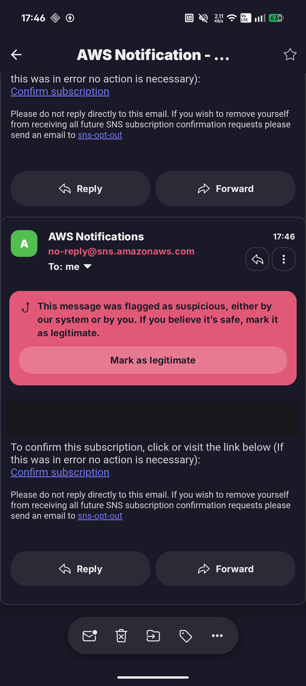

# Cloud

Everything is created by hand through the console or CLI , there is no infrastructure-as-code
in this project. `aws/lambda-role-policy.json` is the one exception, and exists precisely
because nothing else records what the Lambda needs.

## Three identities, easy to conflate

This has cost real debugging time more than once. They are entirely separate, and fixing one
does nothing for the others.

| Identity | Type | Used by | Needs |
|---|---|---|---|
| `arduino-air-quality` | IAM **user** | The pipeline on the laptop, via `aws configure` | DynamoDB write, `sns:Publish` |
| `sensor-api-role-…` | IAM **role** | The `sensor-api` Lambda | `dynamodb:Query`/`GetItem`/`PutItem`, `sns:Subscribe` |
| The SNS topic | Resource | Delivers the alert emails | Subscriptions must be confirmed |

!!! warning "The pipeline publishes; the Lambda subscribes"

    `sns:Publish` belongs to the **user**, because the pipeline is what detects flame and
    sends. `sns:Subscribe` belongs to the **role**, because the Lambda is what registers an
    address when you save settings in the app. Granting one does not cover the other, and the
    symptoms are different: a missing `Publish` fails at alert time, a missing `Subscribe`
    fails at save time.

## DynamoDB

- **Table:** `SensorReadings`
- **Region:** `eu-central-1` (Frankfurt)
- **Partition key:** `device_id` (String)
- **Sort key:** `timestamp` (Number)
- **Billing:** on-demand (`PAY_PER_REQUEST`) , no capacity planning, free-tier friendly at
  this volume

!!! note "No S3 is involved"

    A point of early confusion: DynamoDB has its own fully-managed storage and is not backed
    by any S3 bucket. S3 only appears for optional export/import, which this project doesn't
    use.

Notification preferences live in the **same table** under partition key `prefs#<device_id>`,
which keeps them out of any `/latest` or `/history` result while avoiding a second table.

## Lambda

- **Function:** `sensor-api`, Python 3.12
- **Handler:** `lambda_function.handler`

    !!! warning "Not the default"

        AWS pre-fills `lambda_function.lambda_handler`, which does not match this code's
        function name and produces a 502. See the [debugging log](debugging-log.md).

- **Environment:** `TABLE_NAME`, `SHARED_SECRET`, `SNS_TOPIC_ARN`
- **Function URL:** enabled, auth type `NONE`

### Routes

Routing is on the `rawPath` suffix, so any stage or prefix works. `device_id` is a query
param defaulting to `arduino-01`. Anything unmatched 404s.

| Route | Method | Behaviour |
|---|---|---|
| `/latest` | GET | Newest single row for a device. 404 when the device has never written. |
| `/history` | GET | Requires `start` and `end` unix timestamps. Returns `{"items": [...]}`. |
| `/prefs` | GET | Current notification settings. |
| `/prefs` | POST | Replaces settings and subscribes the address to SNS. |

!!! note "`/history` paginates, and it must"

    A single DynamoDB `query()` page caps at 1 MB, which multi-day ranges exceed. Because
    results come back **ascending**, an unpaginated read drops the *newest* rows , the chart
    would look complete while missing the last few hours. The handler loops on
    `LastEvaluatedKey` up to `MAX_HISTORY_ITEMS` (3000, ~8 days) and sets `"truncated": true`
    when it stops early, which the app surfaces as a banner.

### `configured`

`GET /prefs` returns `configured: false` when nothing has ever been saved.

!!! danger "Unconfigured is not the same as switched off"

    Both produce an empty `channels` list, and they must mean opposite things. Unconfigured
    lets the pipeline fall back to its local settings; explicitly-off must silence it.
    Conflating them once silently disabled alerting entirely , the pipeline saw an empty list
    and went quiet, while the local `.env` was still perfectly configured.

## Authentication

There isn't any, really. The Function URL is `authType: NONE` and the only guard is a shared
secret in a query parameter.

!!! danger "The read routes fail *open*"

    The secret check is skipped entirely when `SHARED_SECRET` is unset, so a missing
    environment variable silently makes the whole endpoint public.

    The **write** route deliberately fails closed instead , `POST /prefs` returns 503 when the
    secret is unset. A route that subscribes arbitrary email addresses would otherwise be an
    open spam relay.

## SNS

Topic `AirQualityAlerts` in `eu-central-1`, email protocol.

- **Email delivery is in the always-free tier** , 1,000 notifications/month, then $2.00 per
  100,000. The alert de-duplication keeps usage far below that; without it, a stuck sensor at
  one reading every 2 s would be ~1.3 million emails a month.
- **SMS is not free** and is billed separately under AWS End User Messaging. This project only
  ever uses `Protocol="email"`.
- **A subscription delivers nothing until confirmed.** AWS emails a confirmation link; until
  it is clicked the subscription reads `PendingConfirmation` and is indistinguishable from a
  working one. The app surfaces that state rather than hiding it.

!!! warning "Deliverability is a genuine problem"

    SNS sends from a shared AWS address with no domain alignment. The confirmation email was
    flagged as suspicious and filed as spam. A mail rule for `sns.amazonaws.com` is
    effectively required for this to function as an alarm.

    

`sns:Unsubscribe` acts on a *subscription* ARN rather than the topic ARN, so scoping it to the
topic may not be sufficient. Unsubscribe failures are swallowed by design so they cannot break
saving settings , which means this fails quietly, and mail simply keeps arriving.

## Deploying the Lambda

By hand. Zip the single file and update the function:

```bash
cd lambda && zip ../deploy.zip lambda_function.py && cd ..
aws lambda update-function-code --function-name sensor-api \
  --region eu-central-1 --zip-file fileb://deploy.zip
aws lambda wait function-updated --function-name sensor-api --region eu-central-1
```

Back up the current code first , `aws lambda get-function --query 'Code.Location'` gives a
download URL , so a rollback is one command.
