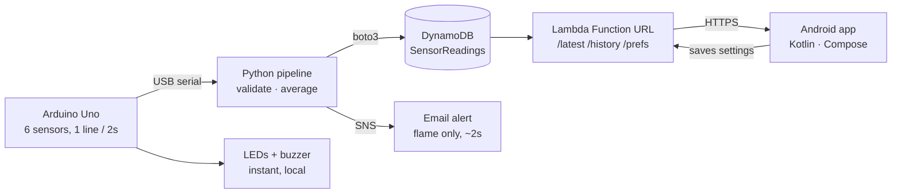

# AirQualityV2

A self-built environmental monitor. An Arduino Uno reads temperature, humidity, sound,
light, gas and flame; a Python pipeline on a laptop averages those readings and writes them
to DynamoDB; a Lambda serves them over HTTP; and a native Android app shows the current
state, the history, and how trustworthy that history actually is.

**If the flame sensor trips, it emails you within about two seconds.**

-   

    The app during a flame detection

-   

    The alert that arrives seconds later

## Architecture

The app never talks to DynamoDB. It only calls the Lambda, so no AWS credentials ever exist
on the phone. The pipeline is the only component that writes to the table.

!!! warning "Two consequences of this shape"

    **Alerts exist only while the pipeline is running.** The laptop is what watches the
    flame sensor. Close the lid and the Arduino's own buzzer still fires, but no email does.

    **The Arduino's LEDs and the stored status are computed independently**, from thresholds
    duplicated by hand in three places. They can disagree , see
    [Calibration](calibration.md#thresholds-are-duplicated-in-three-places).

## What it does

-   __Instant local alarm__

    Green/yellow/red LEDs and a buzzer driven by the Arduino itself, every ~2 seconds. No
    laptop, no network, no cloud in the path.

-   __Averaged windows__

    60 seconds collecting, 180 idle , one averaged row every four minutes, ~360 a day.
    Sound is converted to dB from the averaged raw value, never by averaging decibels.

-   __Validation before averaging__

    Physically impossible readings are rejected before they can skew a window, and the
    rejection count is stored so the app can report how solid each row is.

-   __Flame alerting in ~2 seconds__

    Runs on every reading in both phases, de-duplicated so a fire that keeps burning sends
    one email rather than one every two seconds.

-   __Absence is rendered, not smoothed__

    Charts break across gaps, the status ribbon leaves blank track for outages, and coverage
    reports rows-present against rows-expected.

-   __No credentials on the device__

    The app holds only a shared secret for the Lambda. AWS keys live on the laptop and in
    the Lambda's role, nowhere else.

## Where to go next

| If you want to… | Read |
|---|---|
| Build the circuit | [Hardware](hardware.md) |
| Understand the sensor maths | [Calibration](calibration.md) |
| Know how a reading becomes a row | [Pipeline](pipeline.md) |
| Set up AWS | [Cloud](cloud.md) |
| Run the whole thing | [Setup](setup.md) |
| Know what doesn't work | [Limitations](limitations.md) |

!!! note "About this documentation"

    The source files are always authoritative. Where this site and the code disagree,
    the code is right and this is stale , earlier versions of these notes inlined whole
    copies of the sketch and pipeline, which drifted badly, so that practice was dropped
    in favour of linking to the real files.
