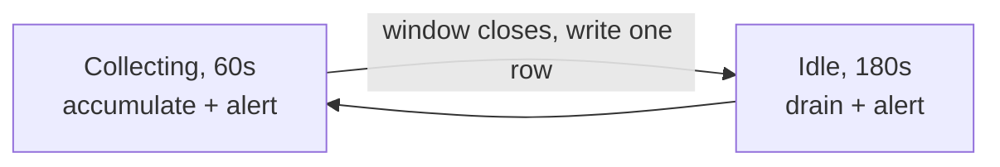

# Pipeline

`pipeline/sensor_pipeline.py` turns a stream of serial lines into averaged rows in DynamoDB,
and independently watches for flame.


## Serial protocol

The Arduino prints one line per reading, roughly every two seconds:

```
Humidity: 48.00%  Temperature: 22.50°C , Sound Level: 412, Light: 300, Gas: 250, Flame: 0, FlameRaw: 320
```

The `Gas:` field is optional, rows written before the MQ-135 arrived omit it, and an older
sketch may still be flashed.

!!! warning "`LINE_PATTERN` is anchored at both ends on purpose"

    It uses the sketch's literal `,` separators rather than `.*?` between fields. The
    permissive version silently **blended** a truncated line with the next one, taking
    temperature from one reading and light and gas from another, and the result passed
    validation and got stored. Anchoring alone does not prevent that; the strict separators
    are what do. If you change the line format, keep both.

### Port detection

The port is auto-detected by USB vendor ID (`0x2341` for Arduino SA, plus the CH340, FTDI
and CP210x IDs used by clones), because the trailing number in `/dev/ttyACM*` is not stable ,
a replug moves the board to `ttyACM1` and a hard-coded path then fails with `Errno 2` while
the board sits there working perfectly. Detection re-runs on **every** reconnect attempt,
since a board that drops out almost always returns on a different node.

Set `SERIAL_PORT` explicitly only to override, e.g. with two boards attached.

### Timeouts and truncated lines

`SERIAL_TIMEOUT_SECONDS = 5`. `pyserial`'s `readline()` returns whatever it has when the
timeout expires, so a 2 s timeout against a ~2.03 s Arduino loop period could split a line in
half and hand the parser a headless fragment. On connect, the pipeline also flushes the input
buffer and discards one line, so the first line it parses is guaranteed to start at
`Humidity:`.

## The collect / idle cycle



During idle the pipeline keeps *reading* serial lines and discarding them for storage
purposes, stopping reads entirely would overflow the OS serial buffer. It still parses them,
because flame alerting runs continuously.

One completed window with at least one valid reading produces exactly one row: about one
row every four minutes, ~360 a day, ~2500 a week. That cadence is what sets the app's range
options and its downsampling cap.

## Averaging rules

- **Raw values are averaged first.** Sound dB is then computed from the averaged raw value
  via `raw_to_db()`, not by averaging individual dB readings, dB is logarithmic.
- **Flame is never averaged.** A single detection anywhere in the window marks the whole
  window, because averaging would hide a brief real detection.
- **`status` is precomputed at write time** as `"red"` (flame), `"yellow"` (any other alert)
  or `"green"`, alongside the human-readable `alerts` list. Readers use it directly and never
  re-derive it.

## Validation vs. alerting

Two different jobs, deliberately separated:

| | `is_valid_reading()` | `check_alerts()` |
|---|---|---|
| Runs | Per reading, before averaging | Per window, on averaged values |
| Rejects | Physically impossible values | Nothing, produces messages |
| Purpose | Keep glitches out of the average | Real-world thresholds |

!!! danger "Flame alerting is deliberately **not** gated on validation"

    A fire drives temperature up and humidity down, so the DHT11 can leave its rated range
    exactly when something is burning. Requiring a fully valid reading would let an
    out-of-range thermometer silence the fire alarm at the moment it matters most.

    Flame alerting, and the stored `flame_detected` flag, are gated only on the flame
    fields themselves being in range. The reading is still excluded from the averages; it
    just no longer takes the alarm down with it.

!!! note "A rejection floor that can bite"

    `is_valid_reading()` rejects the *whole* reading if any single field is out of range, and
    its floors are as tight as its ceilings, `HUMIDITY_MIN = 20` in particular sits above
    what a dry heated room reads in winter. Every reading rejected means no row for that
    window (`No valid readings this window`), which reaches the app as blank track,
    indistinguishable from the laptop being off.

## Flame alerting

Alerting runs on every reading in **both** phases, giving roughly 2 seconds of latency. It
used to run only while collecting, which meant a fire starting just after a window closed
went unseen for up to four minutes.

De-duplication, because readings arrive every ~2 s:

- Notify on the **transition** into flame.
- Then at most once per `FLAME_RENOTIFY_SECONDS` (30 min) while it persists.
- Declare it over only after `FLAME_CLEAR_SECONDS` (60 s) of quiet, so a flickering sensor
  produces one alert rather than an alternating stream of alerts and all-clears.

Measured behaviour: 300 consecutive flame readings produce **one** email; 40 minutes of
flame produce two; a flickering sensor produces one.

!!! note "A flame between windows is carried into the next row"

    Storage samples 60 s in every 240 s, so ~75 % of brief flames were alerted and never
    recorded, the inbox said *fire* while the app showed nothing. Such a detection now marks
    the next stored row `red` with a distinct alert string naming the peak raw value. The cost
    is that it is timestamped up to ~3 minutes late.

Notification failures are swallowed and printed, never raised: the pipeline is still
recording the event that triggered the alert, and losing that to an unreachable mail service
would be the worse failure.

## Stored item shape

```json
{
  "device_id": "arduino-01",
  "timestamp": 1721838000,
  "window_start": 1721838000,
  "window_end": 1721838060,
  "temperature": 23.4,
  "humidity": 48.0,
  "sound_raw": 412.0,
  "sound_db": 61.6,
  "light_raw": 310.0,
  "gas_raw": 379.8,
  "flame_raw": 3.0,
  "flame_detected": false,
  "alerts": [],
  "status": "green",
  "sample_count": 28,
  "rejected_count": 1
}
```

`timestamp` equals `window_start` and is the sort key. `gas_raw` is `null` when the sketch
omits the field; `sound_db` is `null` when `raw_to_db()` returned nothing.

!!! note "Floats must become `Decimal`"

    boto3's DynamoDB resource layer rejects native Python `float`. `floats_to_decimal()`
    recursively converts before every `put_item`, using `Decimal(str(value))`, via `str()`
    first, to avoid floating-point artefacts. The Lambda mirrors this in reverse.

## Configuration

Notification settings come from the environment, loaded by `./run_pipeline.sh` from
`pipeline/.env`, which is gitignored via `*.env`:

```bash
AIRQ_LAMBDA_URL=https://<id>.lambda-url.eu-central-1.on.aws
AIRQ_LAMBDA_KEY=<the Lambda's SHARED_SECRET>
AIRQ_SNS_TOPIC_ARN=arn:aws:sns:eu-central-1:<account>:AirQualityAlerts
```

All optional, unset means that piece is switched off and the pipeline behaves as it did
before notifications existed. They are not constants in the source because `AIRQ_LAMBDA_KEY`
is a secret and `sensor_pipeline.py` is tracked in git.

Preferences saved from the app are fetched from `/prefs` once per cycle. A failed fetch keeps
the last known good settings, because dropping to "no channels" the moment the network blips
is exactly when an alert matters.
